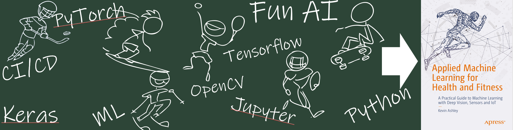

# AI in Sports With Python

See the full [VIDEO COURSE](http://ai-learning.vhx.tv), with access to all episodes and instructional videos!

This video course works best with my book "Applied Machine Learning for Health and Fitness" [APRESS](https://www.apress.com/us/book/9781484257715) or [buy on Amazon](https://www.amazon.com/Applied-Machine-Learning-Health-Fitness/dp/1484257715)

Check my website: [activefitness.ai/ai-in-sports-with-python](http://activefitness.ai/ai-in-sports-with-python) for the latest updates.

## Table of Contents

Welcome! Each This is the source code for the video course [AI in Sports with Python](http://ai-learning.vhx.tv). you can quickly jump to notebooks from this file. It is recommended that your kernel environment for Azure Notebooks is set to Python 3.6. Check [requirements.txt](requirements.txt) for dependencies.

 [VIDEO COURSE EPISODES](http://ai-learning.vhx.tv)

- Module 1 - Getting Started
    - Episode 1.1 - Getting Started
    - Episode 1.2 - Data Scientist Toolbox
- Module 2 - Physics of Sports
    - Episode 2.1 - Sensors
    - Episode 2.2 - Kinematics ([Video](https://ai-learning.vhx.tv/packages/ai-in-sports-with-python/videos/episode-2-2-kinematics) | [Notebook](4_Kinematics.ipynb))
    - [Episode 2.3 - Figure Skating](5_FigureSkating.ipynb)
- Module 3 - Neural Networks
    - [Episode 3.1 - Neural Networks](3.1_NeuralNetworks.ipynb)
    - [Episode 3.2 - Simple Neural Network](3.2_SimpleNeuralNetwork.ipynb)
    - [Episode 3.3 - Multi-Layer Neural Network](3.3_Multi-LayerNetworks.ipynb)
- Module 4 - Deep Vision
    - [Episode 4.1 - Computer Vision](4.1_ComputerVision.ipynb)
    - [Episode 4.2 - Classification](4.2_Classification.ipynb)
    - [Episode 4.3 - Detection](4.3_Detection.ipynb)
    - [Episode 4.4 - Segmentation](4.4_Segmentation.ipynb)
    - [Episode 4.5 - Human Body Joints](4.5_HumanBodyJoints.ipynb)
- Module 5 - Human Body Pose Estimation
- Module 6 - Video Action Recognition 
- Module 7  - Reinforcement Learning
    - [Episode 7.1 - Reinforcement Learning](7.1_ReinforcementLearning.ipynb)
    - [Episode 7.2 - Skateboarding](7.2_Skateboarding.ipynb)
    - [Episode 7.3 - Gymnastics](7.3_Gymnastics.ipynb)
    - [Episode 7.4 - Human Models](7.4_HumanModels.ipynb)
- Module 8 - Machine Learning in the Cloud
