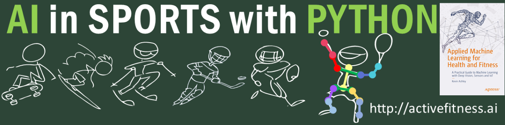

# AI in Sports with Python

See the full [VIDEO COURSE](http://ai-learning.vhx.tv), with access to all episodes and instructional videos!

This video course works best with my book "Applied Machine Learning for Health and Fitness" [APRESS](https://www.apress.com/us/book/9781484257715) or [buy on Amazon](https://www.amazon.com/Applied-Machine-Learning-Health-Fitness/dp/1484257715)

Check my website: [activefitness.ai/ai-in-sports-with-python](http://activefitness.ai/ai-in-sports-with-python) for the latest updates.

## Table of Contents

Please, use these supplemental materials and code for the video course [AI in Sports with Python](http://ai-learning.vhx.tv). 

[Complete list of videos](https://ai-learning.vhx.tv/products/ai-in-sports-with-python), you can also navigate to individual videos and notebooks below.

For notebooks, it is recommended that your kernel environment is set to Python 3. Check [requirements.txt](requirements.txt) for dependencies.

 [VIDEO COURSE EPISODES](http://ai-learning.vhx.tv)

- Module 1 - Getting Started
    - Episode 1.1 - Getting Started ([Video](https://ai-learning.vhx.tv/packages/ai-in-sports-with-python/videos/episode-10-4-human-models))
    - Episode 1.2 - Sport Scientist Toolbox ([Video](https://ai-learning.vhx.tv/packages/ai-in-sports-with-python/videos/episode-10-4-human-models) | [Notebook](1.2_SportScientistToolbox.ipynb))
    - Episode 2.1 - Sensors
    - Episode 2.2 - Kinematics ([Video](https://ai-learning.vhx.tv/packages/ai-in-sports-with-python/videos/episode-2-2-kinematics) | [Notebook](2.2_Kinematics.ipynb))
    - Episode 2.3 - Figure Skating ([Video](https://ai-learning.vhx.tv/packages/ai-in-sports-with-python/videos/episode-2-3-figure-skating) | [Notebook](2.3_FigureSkating.ipynb))
- Module 3 - Neural Networks
    - Episode 3.1 - Neural Networks ([Video](https://ai-learning.vhx.tv/packages/ai-in-sports-with-python/videos/episode-4-1-neural-networks-101) | [Notebook](3.1_NeuralNetworks101.ipynb))
    - Episode 3.2 - Simple Neural Network ([Video](https://ai-learning.vhx.tv/packages/ai-in-sports-with-python/videos/episode-4-2-make-a-simple-neural-net) | [Notebook](3.2_SimpleNeuralNetwork.ipynb))
    - Episode 3.3 - Multi-Layer Neural Network ([Video](https://ai-learning.vhx.tv/packages/ai-in-sports-with-python/videos/amlhf-ch4-3-multilayernetworks) | [Notebook](3.3_Multi-LayerNetworks.ipynb))
- Module 4 - Deep Vision
    - Episode 4.1 - Computer Vision ([Video](https://ai-learning.vhx.tv/packages/ai-in-sports-with-python/videos/amlhf-ch6-1-computervision) | [Notebook](4.1_ComputerVision.ipynb))
    - Episode 4.2 - Classification ([Video](https://ai-learning.vhx.tv/packages/ai-in-sports-with-python/videos/amlhf-ch6-2-classification) | [Notebook](4.2_Classification.ipynb))
    - Episode 4.3 - Detection ([Video](https://ai-learning.vhx.tv/packages/ai-in-sports-with-python/videos/amlhf-ch6-3-detection) | [Notebook](4.3_Detection.ipynb))
    - Episode 4.4 - Segmentation ([Video](https://ai-learning.vhx.tv/packages/ai-in-sports-with-python/videos/amlhf-ch6-4-segmentation) | [Notebook](4.4_Segmentation.ipynb))
    - Episode 4.5 - Human Body Joints ([Video](https://ai-learning.vhx.tv/packages/ai-in-sports-with-python/videos/ai-in-sports-ep-4-5-humanjoints) | [Notebook](4.5_HumanBodyKeypoints.ipynb))
- Module 5 - Pose Estimation
    - Episode 5.1 - Introducing Pose Estimation ([Video](https://ai-learning.vhx.tv/packages/ai-in-sports-with-python/videos/ai-in-sports-ep-5-1-poseestimation))
    - Episode 5.2 - Surfing ([Video](https://ai-learning.vhx.tv/packages/ai-in-sports-with-python/videos/ai-in-sports-ep-5-2-surfing) | [Notebook](5.2_Surfing.ipynb))
    - Episode 5.3 - Skill Level Detection ([Video](https://ai-learning.vhx.tv/packages/ai-in-sports-with-python/videos/ai-in-sports-ep-4-5-humanjoints) | [Notebook](5.3_SkillLevelDetection.ipynb))
    - Episode 5.4 - Multi-Person Detection ([Video](https://ai-learning.vhx.tv/packages/ai-in-sports-with-python/videos/ai-in-sports-ep-5-4-multipersondetection) | [Notebook](5.4_Multi-PersonDetection.ipynb))
- Module 6 - Video Action Recognition 
    - Episode 6.1 - Video Action Recognition ([Video](https://ai-learning.vhx.tv/packages/ai-in-sports-with-python/videos/ai-in-sports-ep-6-1-videoactionrecognition) | [Notebook](6.1_VideoActionRecognition.ipynb))
    - Episode 6.2 - Video Classification ([Video](https://ai-learning.vhx.tv/packages/ai-in-sports-with-python/videos/ai-in-sports-ep-6-2-videoclassification) | [Notebook](6.2_VideoClassification.ipynb))
- Module 7  - Reinforcement Learning
    - Episode 7.1 - Reinforcement Learning ([Video](https://ai-learning.vhx.tv/packages/ai-in-sports-with-python/videos/episode-10-1-reinforcement-learning) | [Notebook](7.1_ReinforcementLearning.ipynb))
    - Episode 7.2 - Skateboarding ([Video](https://ai-learning.vhx.tv/packages/ai-in-sports-with-python/videos/episode-10-2-skateboarding) | [Notebook](7.2_Skateboarding.ipynb))
    - Episode 7.3 - Gymnastics ([Video](https://ai-learning.vhx.tv/packages/ai-in-sports-with-python/videos/episode-10-3-gymnastics) | [Notebook](7.3_Gymnastics.ipynb))
    - Episode 7.4 - Human Models ([Video](https://ai-learning.vhx.tv/packages/ai-in-sports-with-python/videos/episode-10-4-human-models) | [Notebook](7.4_HumanModels.ipynb))
- Module 8 - Machine Learning in the Cloud
    - Episode 8.1 - Machine Learning in the Cloud ([Video](https://ai-learning.vhx.tv/packages/ai-in-sports-with-python/videos/episode-10-4-human-models) | [Notebook](8.1_CloudBasedAI.ipynb))
    - Episode 8.2 - Automating, Consuming ML, Pipelines ([Video](https://ai-learning.vhx.tv/packages/ai-in-sports-with-python/videos/episode-10-4-human-models) | [Notebook](8.2_MLAutomation.ipynb))
